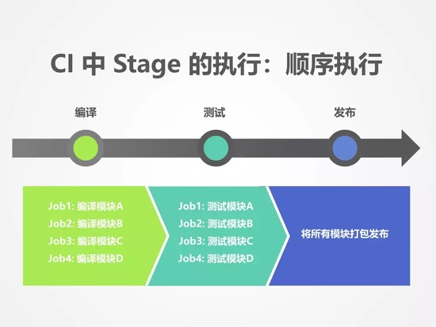
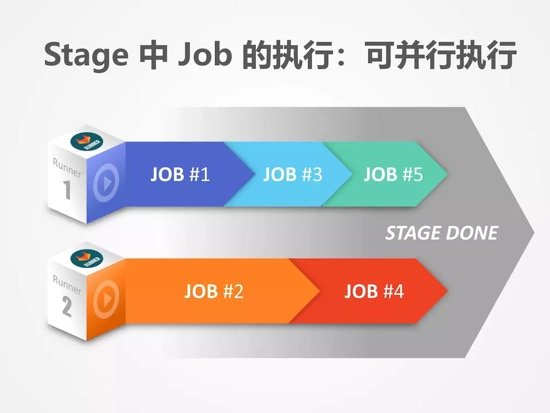
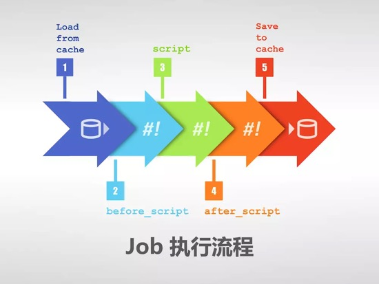

# GitLab CI Pipeline框架

本文介绍GitLab CI框架，帮助大家理解其架构，以设计适合自己的 CI 环境。

## 1.基本概念

### 1.1 GitLab CI

>GitLab CI/CD is a powerful tool built into GitLab that allows you to apply all the continuous methods (Continuous Integration, Delivery, and Deployment) to your software with no third-party application or integration needed.

GitLab CI是 GitLab 内置的功能，在你安装好 GitLab 之后，即同时安装了 GitLab CI。

<https://docs.gitlab.com/ce/ci/introduction/>


### 1.2 GitLab Runner

>GitLab Runner is the open source project that is used to run your jobs and send the results back to GitLab. It is used in conjunction with GitLab CI, the open-source continuous integration service included with GitLab that coordinates the jobs.

GitLab Runner是任务执行器，从 GitLab  CI 中获取到任务，并按其要求完成任务的执行。<https://docs.gitlab.com/runner/>

### 1.3 Pipeline

>Pipelines are the top-level component of continuous integration, delivery, and deployment.

PipeLine 即流水线是持续集成、发布、部署的最顶层的组件。由 Stage 和 Job 组成，由.gitlab-ci.yml来定义。按触发模式可分为：自动触发和人工触发。<https://docs.gitlab.com/ee/user/project/pipelines/schedules.html>

* 自动触发
  * 定时触发
  * Merge请求触发<https://docs.gitlab.com/ee/ci/merge_request_pipelines/index.html>
* 人工触发

### 1.4 .gitlab-ci.yml

### 1.5 Stage

>Stages that define when and how to run. For example, that tests run only after code compilation.

Stage 即阶段定义为何时如何运行。

### 1.6 Job

>Jobs that define what to run. For example, code compilation or test runs.Multiple jobs in the same stage are executed by Runners in parallel, if there are enough concurrent Runners.

Job即任务定义为运行的内容。可自定义名称，但 GitLab 保留了一些关键字。

### 1.7 Script

>script is the only required keyword that a job needs. It’s a shell script which is executed by the Runner. 

script是规划制定具体指令。
<https://docs.gitlab.com/ee/ci/yaml/README.html#script>

## 2. Pipeline逻辑框架

### 2.1 层次关系图

```
GitLab-CI
  |-- Pipeline P0
    |-- Stage A
        |-- Job A1
        |-- Job A2
        |-- Job ...
    |-- Stage B
        |-- Job B1
        |-- Job B2
        |-- Job ...
    |-- Stage ...
        |-- ...
  |-- Pipeline P1
    |-- Stage A
        |-- Job A1
        |-- Job A2
        |-- Job ...
```

### 2.2 部署关系图

```
GitLab (GitLab-CI) Server（主）  --> GitLab (GitLab-CI) Server (热备)
    |-- 获取并执行 Job-- Build Server（GitLab Runner）
    |-- 获取并执行 Job-- Test Server（GitLab Runner）
```
### 2.3 CI/CD基本工作流


### 2.4 Pipeline元素关系图解





## 参考

* <https://www.jianshu.com/p/306cf4c6789a>
* <https://docs.gitlab.com/ee/ci/yaml/README.html>
* <https://docs.gitlab.com/ee/ci/pipelines.html>