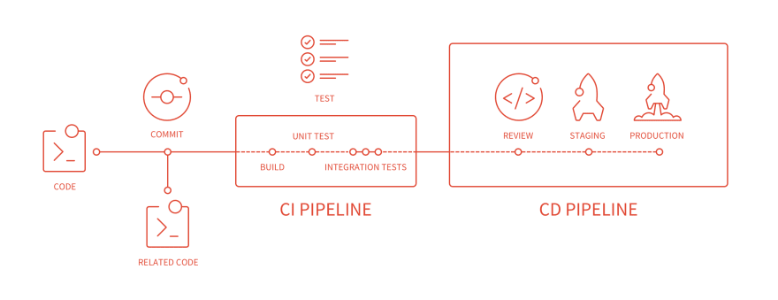
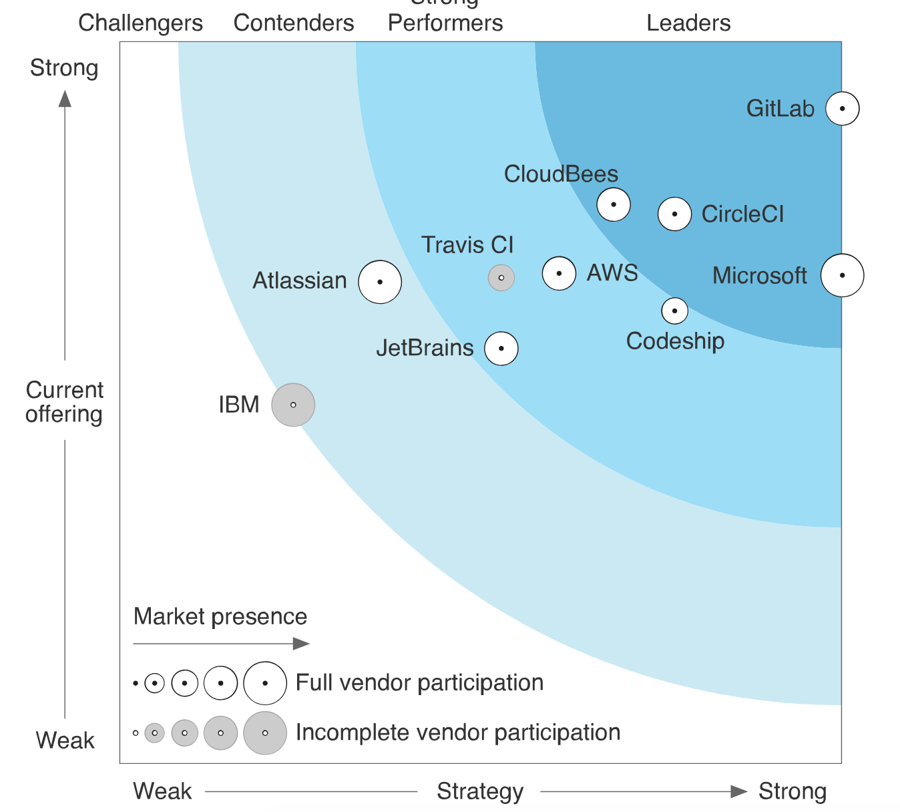

# 基于 GitLab 搭建持续集成环境

## What is CI/CD?

Continuous Integration is the practice of integrating code into a shared repository and building/testing each change automatically, as early as possible - usually several times a day.
Continuous Delivery adds that the software can be released to production at any time, often by automatically pushing changes to a staging system.
Continuous Deployment goes further and pushes changes to production automatically.

## Why CI/CD?

Continuous Integration
Detects errors as quickly as possible: fix problems while fresh in developers mind
Reduces integration problems: smaller problems are easier to digest
Avoid compounding problems: allows teams to develop faster, with more confidence
Continuous Delivery
Ensures every change is releasable: test everything, including deployment, before calling it done
Lowers risk of each release: makes releases “boring”
Delivers value more frequently: reliable deployments mean more releases
Tight customer feedback loops: fast and frequent customer feedback on changes

## 为什么是 [GitLab](https://about.gitlab.com/product/continuous-integration/)

* Integrated: GitLab CI/CD is part of GitLab, enabling a single conversation from planning to deployment (and beyond)
* Easy to learn: See our Quick Start guide
* Seamless: Part of the single GitLab application, with a single great user experience
* Scalable: Tests run distributed on separate machines of which you can add as many as you want
* Faster results: Each build can be split in multiple jobs that run in parallel on multiple machines
* Optimized for delivery: multiple stages, manual deploy gates, environments, and variables
* Open source: CI/CD is a part of both the open source GitLab Community Edition and the proprietary GitLab Enterprise Edition

## 方案Architecture

GitLab CI/CD is a part of GitLab, a web application with an API that stores its state in a database. It manages projects/builds and provides a nice user interface, besides all the features of GitLab.

GitLab Runner is an application which processes builds. It can be deployed separately and works with GitLab CI/CD through an API.

In order to run tests, you need at least one GitLab instance and one GitLab Runner.

### GitLab Runner

To perform the actual build, you need to install GitLab Runner which is written in Go.

It can run on any platform for which you can build Go binaries, including Linux, OSX, Windows, FreeBSD and Docker.

It can test any programming language including .Net, Java, Python, C, PHP and others.

GitLab Runner has many features, including autoscaling, great Docker support, and the ability to run multiple jobs concurrently.

## 搭建

## 流程

## 经验

* View a step-by-step guide to [migrate from Jenkins to GitLab](https://www.youtube.com/watch?v=RlEVGOpYF5Y)