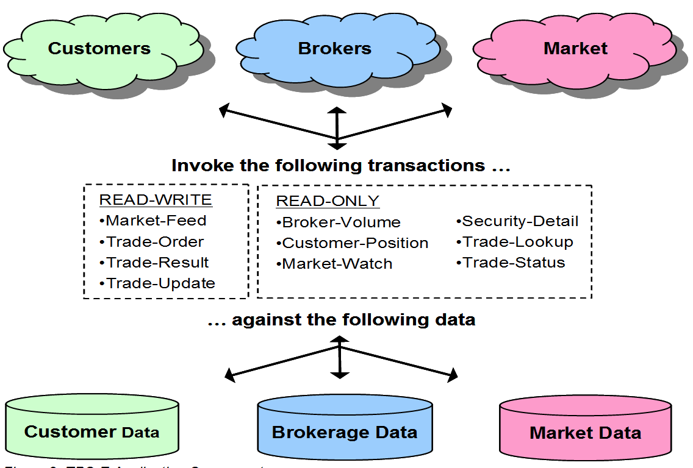

# 如何基于 Markdown 编写技术文档

## 需求

1. 文档版本清晰化，充分利用Git 的版本管理能力，轻松对比不同版的修改演进。
2. 减少在文档格式排版上的投入，争取简历上不再有精通word。
3. 充分利用开发者既有工具，减少工具量，少就是多。

## 工具链

* OS：macOS Mojave V10.14.3
* IDE：Visual Studio Code
* Visual Studio Code扩展插件：
  * markdownlint：在写书中如有违规，会在编辑区提示你。
  * Markdown PDF：将 md 文件转换为 pdf、html、jgp 等，便于非技术人员阅读。
  * Preview：预览最终效果。
  * Excel to Markdown table: 将 Excel 表快速变成 markdown 格式的。

## 技术文档基本元素的实现

### 文章标题及各章节标题

用“#”来标记标题，每增加一级增加一个 # ，字号也会减小。# 和文字之间留一个空格。

```markdown
# 史上最牛的设计方案
## 1. 产品需求
### 1.1 功能需求
#### 1.1.1 移动端需求
##### 1.1.1.1 iOS 版需求
###### 1.1.1.1.1 支持 Carplay
### 1.2 非功能需求
## 2. 产品设计
## 3. 资源需求
```

### 信息列表

在文字前面加上 * 或 数字 1. 2. 3. 等即可显示列表。

#### 无序列表的语法示例

```markdown
* 性能需求
* 稳定性需求
* 兼容性需求
```

##### 无序列表的显示效果

* 性能需求
* 稳定性需求
* 兼容性需求

#### 有序列表的语法示例

```markdown
1. 设计约束1
2. 设计约束2
3. 设计约束3
```

##### 有序列表的显示效果

1. 设计约束1
2. 设计约束2
3. 设计约束3

### 表格

#### 语法示意

```markdown
| 序号 | 姓名 | 年龄  |
|---- |:----:| ----:|
|  1  | 张三 | 20 |
|  2  | 李四 | 30 |
|  3  | 王五 | 40 |
```

显示效果：

| 序号 | 姓名 | 年龄 |
|----|:----:| ----:|
| 1 | 张三 | 20 |
| 2 | 李四 | 30 |
| 3 | 王五 | 40 |

说明：
* ”：---：“ 居中对齐
* ”---：“ 右对齐
* 默认左对齐

#### 基于插件快速搞定

手工编辑大表有点反人性，基于“Excel to Markdown table”会省心很多，具体如下：

1. 在 Excel 中建好所用表
2. 回到VS Code 中，打开需要粘贴的 md 文件
3. 使用快捷键“Shift + Alt + V”
4. 完成。

### 嵌入代码

* 需要引用代码时，如果只引用一段，不用分行，可以用 ` 将语句包起来。
* 如果引用的语句为多行，可以将\`\`\`置于这段代码的首行和末行，在开始的\`\`\`后面加上语言，便于相关解析器排版配色。

#### 示例1: bash语句

##### 示例1：语法

\`\`\`bash

\#!/bin/bash

echo Hello world

\`\`\`

##### 示例1：最终效果

```bash
#!/bin/bash
echo Hello world
```

#### 示例2: sql语句

##### 示例2：语法

\`\`\`sql

SELECT Persons.LastName, Persons.FirstName, Orders.OrderNo
FROM Persons
INNER JOIN Orders
ON Persons.Id_P = Orders.Id_P
ORDER BY Persons.LastName

\`\`\`

##### 示例2：最终效果

```sql
SELECT Persons.LastName, Persons.FirstName, Orders.OrderNo
FROM Persons
INNER JOIN Orders
ON Persons.Id_P = Orders.Id_P
ORDER BY Persons.LastName
```

### 链接

#### 语法

```markdown
[a link](https://commonmark.org/)
```

#### 最终效果

[a link](https://commonmark.org/)

### 图片

与链接类似，使用 `` 来展示图片。

- 网络图片
  - ``
  - 
- 本地图片
  - ``
  - 

### 引用

在需要引用他人的参考信息时，在引用的文字前面加上 > ，例如：

```makrdown
> TPC Benchmark E is an on-line transaction processing (OLTP) benchmark. TPC-E is more complex than previous OLTP benchmarks such as TPC-C because of its diverse transaction types, more complex database and overall execution structure. 
```
注：> 和文本之间要保留一个字符的空格。

最终显示效果：
> TPC Benchmark E is an on-line transaction processing (OLTP) benchmark. TPC-E is more complex than previous OLTP benchmarks such as TPC-C because of its diverse transaction types, more complex database and overall execution structure. 

## 生成外发文档

* 按 F1
* 按提示选择 “markdown-pdf: Export (pdf)”
* 按回车，即生成 PDF 文件

## 常用Tips

### 获得目录的树形展示

Mac默认没有 tree 命令，又不想安装其他工具，可以通过下面的命令来救急。

```bash
find . -print | sed -e 's;[^/]*/;|____;g;s;____|; |;g'
```

### 预览效果

* 方式1：使用侧边预览
  * 优点：markdown 编辑窗口与预览窗口并列，及时反馈。
  * 不足：空间受限，会影响排版效果。
  * 点击编辑框右上角图标启动。
* 方式2：使用独立页面预览
  * 优点：完整展示效果
  * 不足：反馈滞后
  * 快捷键：Shift + Cmd + V

## 扩展阅读

* [https://commonmark.org/](https://commonmark.org/)
* [https://thisdavej.com/build-an-amazing-markdown-editor-using-visual-studio-code-and-pandoc/](https://thisdavej.com/build-an-amazing-markdown-editor-using-visual-studio-code-and-pandoc/)